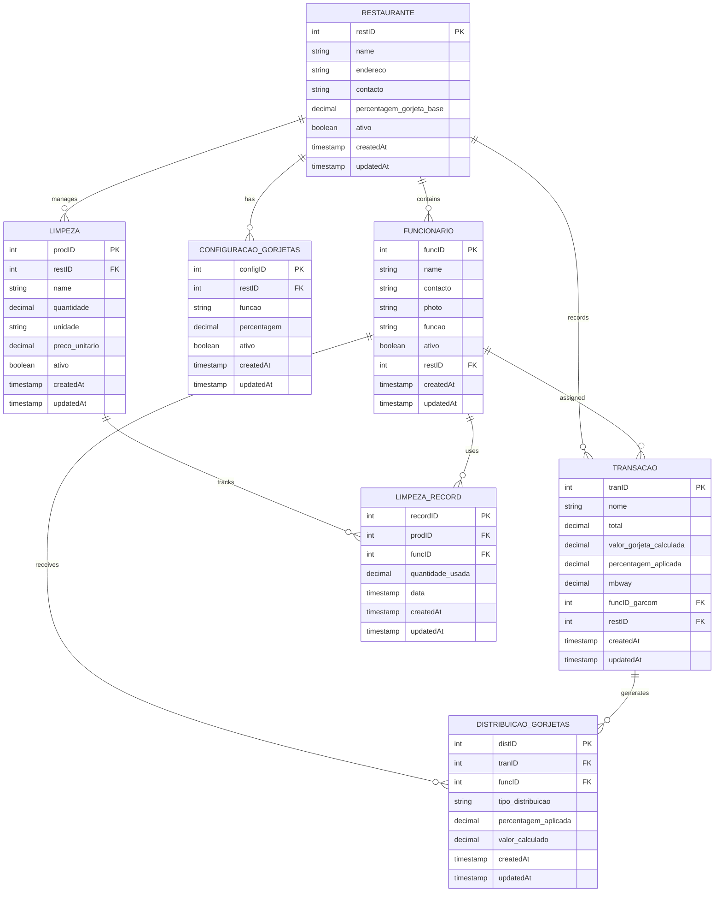

# ER Diagram - Restaurantes DB Schema

## Entity Relationship Diagram



## Key Relationships

### Restaurant (1:N) → Employees
- One restaurant has many employees
- Soft delete via `ativo=false`

### Employee (N:1) → Restaurant
- Each employee belongs to one restaurant
- Scoped by `restID` for multi-tenant isolation

### Configuration (1:1) → (Restaurant, Function)
- One active config per (restID, funcao)
- Defines tip distribution %

### Transaction (1:N) → Distribution
- One transaction generates many distribution rows
- All distributions created atomically on transaction creation

### Distribution (N:1) → Employee & Transaction
- Links employee to transaction
- Stores calculated tip amount for that employee

## Data Constraints

- **Primary Keys:** All auto-incrementing integers
- **Foreign Keys:** Enforced with CASCADE delete where applicable
- **Unique Constraints:** (restID, funcao) on ConfiguracaoGorjetas and Funcionario
- **Decimal Precision:** 2 decimal places for all currency fields
- **Soft Delete:** `ativo` boolean flag (defaults to true)

## Multi-Tenant Isolation

All queries for a specific restaurant filter by `restID`:

```sql
SELECT * FROM transacoes WHERE restID = 1
SELECT * FROM funcionarios WHERE restID = 1 AND ativo = true
```

## Timestamps

All tables include:
- `createdAt` — Record creation time (immutable)
- `updatedAt` — Last update time (auto-managed by Prisma)

Enables audit trail and sorting for reports.
