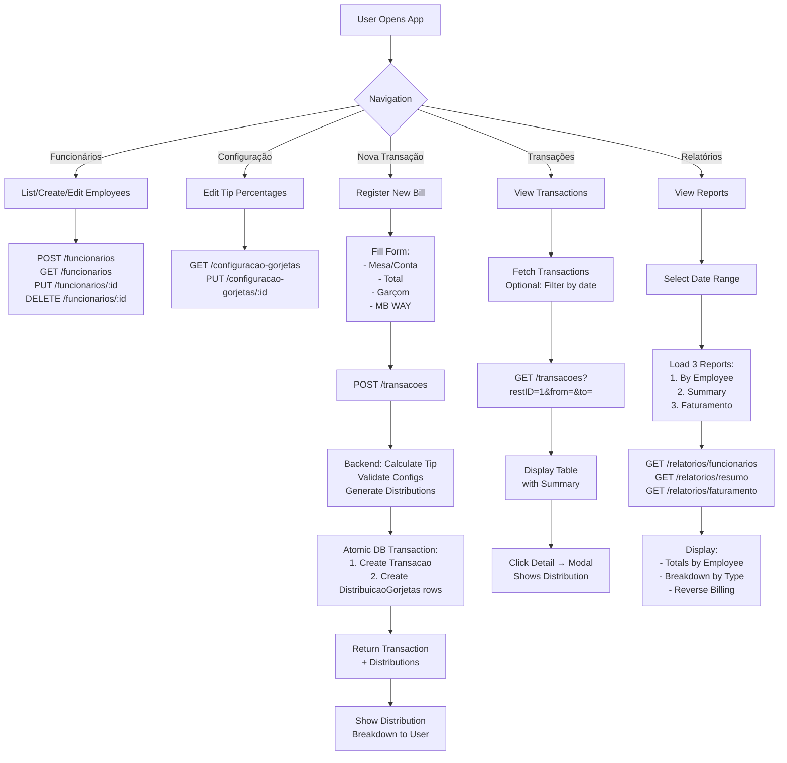
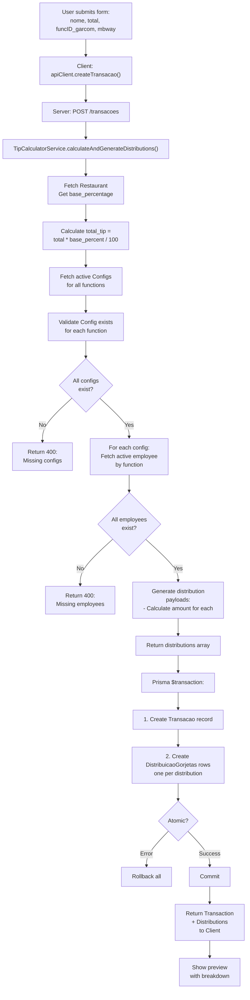
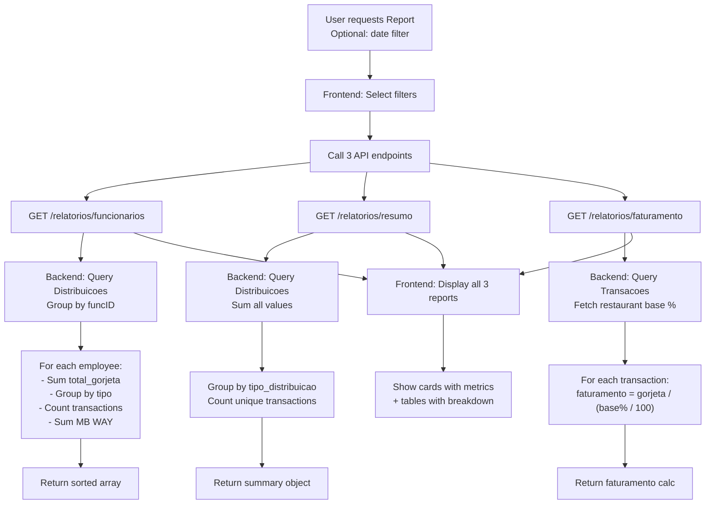
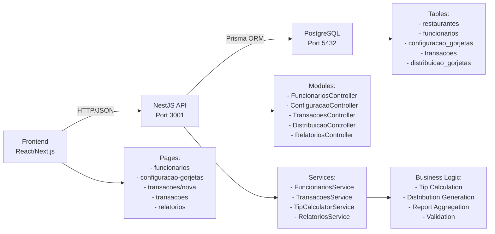
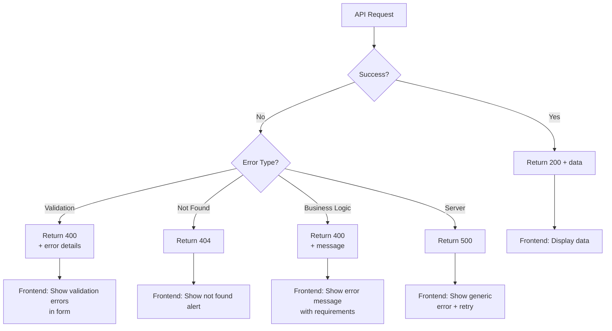

# Flow Diagram - Gorjetas Management System

## Application Flow



## Transaction Creation Flow (Details)



## Report Generation Flow



## Data Flow Architecture



## State Management (Frontend)

```
Component State:
├── functionarios: Funcionario[]
├── configurations: Configuracao[]
├── transactions: Transacao[]
├── reports: Reports
├── loading: boolean
├── error: string
└── filters: DateRange
```

## Error Handling Flow



---

**Architecture Summary:**
- **Frontend:** React/Next.js with simple forms and table views
- **Backend:** NestJS with modular structure and Prisma ORM
- **Database:** PostgreSQL with atomic transactions for data consistency
- **Multi-tenancy:** All queries filtered by `restID`
- **Validation:** Both frontend (client-side) and backend (server-side)
- **Atomic Operations:** Transaction + Distributions created in single DB transaction
